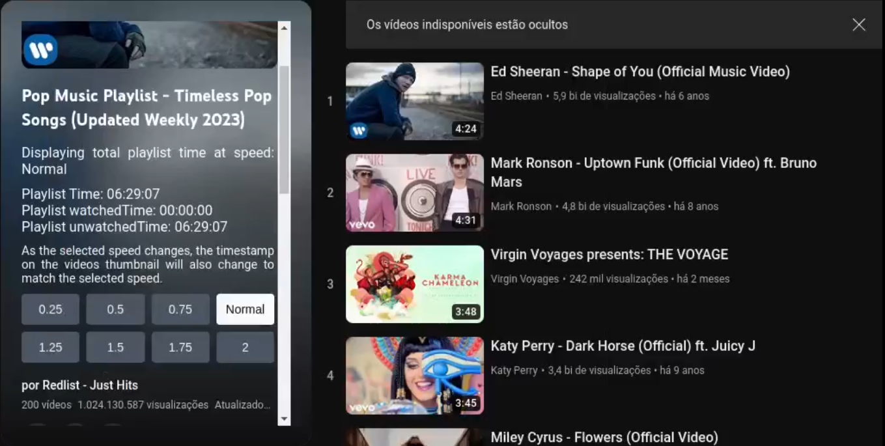
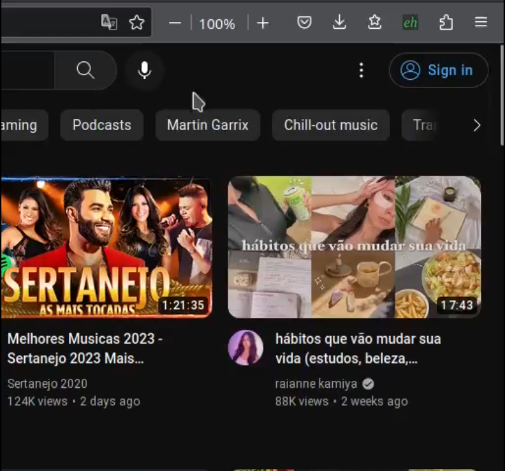

# YouTube-Playlist-Time-Info

A WEB extension that show you the time stats of your YouTube playlists! Relax, we don't need your credentials.

 

  
  
 
 
 
 

 

  

  

  

 

# What's new

* <b>Feature:</b> The extension now lets you view the playback time of the playlist and its videos according to the selected speed, as shown in the video below:

 

 

* <b>Update:</b> The extension automatically resets when the user switches pages.

 

# How to install

### Chrome | Vivaldi | Brave

1. Access <a  href="https://chrome.google.com/webstore/detail/youtube-playlist-time-inf/baiijeboainjcealpenohoogjkplopmh">Chrome Web Store page</a>

### Firefox

1. Access <a  href="https://addons.mozilla.org/pt-BR/firefox/addon/youtube-playlist-time-info/">add-ons page</a>
2. Access <a href="https://www.youtube.com">YouTube </a>
3. Follow the setup steps shown in the video below:

### Opera

1. Access <a  href="https://addons.opera.com/en/extensions/details/youtube-playlist-time-info/">addons page</a>

### Microsoft Edge

1. Access <a  href="https://microsoftedge.microsoft.com/addons/detail/youtube-playlist-time-inf/ndillecpkaamieconfpcilmipnigaoja">add-ons page</a>
